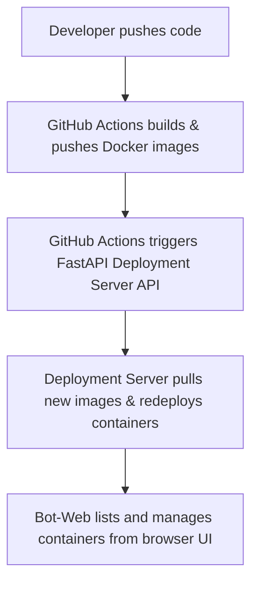

# 🔧 Automated Docker Deployments & Bot-Web Monitoring Tool

---

## 🔍 Overview

This project showcases two independently valuable tools built during my DevOps learning journey:

1. **API-First Automated Deployment System**: A FastAPI-based server that automates pulling Docker images and deploying them securely via API calls — ideal for development & testing environments.

2. **Bot-Web Monitoring Tool**: A FastAPI + React.js based container monitoring web app to **list, start, stop, and view logs** of Docker containers on the host.

Both tools are designed to run on **any server infrastructure (cloud, home lab, or on-premises)** with secure HTTPS exposure using **Cloudflare Tunnel**, requiring no SSH or direct server access.

---

## 🔹 Key Features

### API-First Automated Deployments

- Trigger Docker image pulls and deployments with a single API call
- GitHub Actions integration for seamless CI/CD
- Secure API authentication with an API key
- Minimal downtime: old containers stopped before starting new ones
- Supports rapid dev/test deployments without manual server access

### Bot-Web - Docker Monitoring from Your Browser

- List **all containers** (running & stopped)
- Start and stop containers via UI
- View container logs (**on refresh**)
- Clean React.js frontend, FastAPI backend
- Secured with Cloudflare Tunnel for HTTPS public access

---

## 🔹 Architecture





---

## 🔹 Deployment Server API Endpoints

### POST `/deployee`
Deploy latest frontend & backend images from Docker Hub.
- **Header:** `X-API-KEY: <your-secret-key>`

### GET `/containers`
Lists all Docker containers (running & stopped).
- **Header:** `X-API-KEY: <your-secret-key>`

---

## 🔹 Bot-Web Features

- Accessible UI to monitor all containers on the host
- Start/Stop containers directly from your browser
- View logs for troubleshooting (**refresh to update**)  
- Requires no API; interacts directly with the Docker host

---

## 🔹 Security & Deployment

- Cloudflare Tunnel protects your server with HTTPS and hides your IP
- No SSH access needed for deployments or monitoring
- API access secured with API keys in `.env`

Example `.env` file:
```env
API_KEY=your-secret-api-key
FRONTEND_IMAGE_URL=ashu111/bot-web-frontend:latest
BACKEND_IMAGE_URL=ashu111/bot-web-backend:latest
````

---

## 🔹 Deployment Server Usage

### Build the Deployment API Server

```bash
docker build -t bot-web-server:1 ./server
```

### Run the Deployment Server (Exposed on Port 9000)

```bash
docker run -v /var/run/docker.sock:/var/run/docker.sock -p 9000:9000 bot-web-server:1
```

### Example API Trigger (Deploy Containers)

```bash
curl -X POST https://<your-domain>/deployee \
     -H "X-API-KEY: your-secret-api-key"
```

---

## 🔹 Tech Stack

- **FastAPI**: Deployment server & Bot-Web backend
- **React.js + Tailwind CSS**: Bot-Web frontend
- **Docker**: Containerization
- **GitHub Actions**: CI/CD automation
- **Cloudflare Tunnel**: Secure public access

---

## 🔹 Measured Impact

| Metric                      | Before (Manual)       | After (Automated)           |
| --------------------------- | --------------------- | --------------------------- |
| Deployment Time             | \~8 min               | \~2 min                     |
| Server Access               | SSH + Docker CLI      | Secure API Call             |
| Security Exposure           | Open SSH/Docker ports | HTTPS Tunnel + Auth         |
| Downtime During Deployments | High                  | Minimal (container restart) |

---

## 🔹 Future Improvements

- Real-time logs & WebSocket support for Bot-Web
- Add role-based access control (RBAC)
- Improve error handling & observability
- Extend to Kubernetes (optional)

---

## 🔹 Summary

This project is a practical example of how DevOps automation can simplify infrastructure management and save development time. It's ideal for:

- Home lab & self-hosted setups
- Small teams automating dev/test deployments
- Anyone learning secure server automation with Docker & FastAPI

---

## 🔹 Repository

GitHub: [https://github.com/ashupal86/bot-web](https://github.com/ashupal86/bot-web)

---

Created by Ashish Pal
